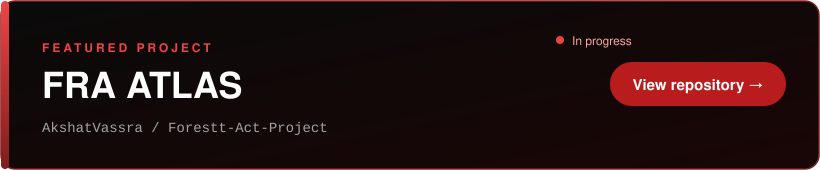

 

  

 

## ⚡ Snapshot

 

 

## 🛠️ Tech Stack

<table>
<tr>
<td width="170"><b>Languages</b></td>
<td></td>
</tr>
<tr>
<td><b>Frontend</b></td>
<td></td>
</tr>
<tr>
<td><b>Backend & Data</b></td>
<td></td>
</tr>
<tr>
<td><b>AI / ML</b></td>
<td></td>
</tr>
<tr>
<td><b>Cloud & Tooling</b></td>
<td></td>
</tr>
</table>

 

## 📊 Live Activity

> Auto-generated from my GitHub account every few hours, including private contributions.

<table>
<tr>
<td width="50%" valign="top">
  
</td>
<td width="50%" valign="top">
  
   
  
</td>
</tr>
</table>

  

 

  <picture>
    <source media="(prefers-color-scheme: dark)" srcset="https://raw.githubusercontent.com/AkshatVassra/AkshatVassra/output/github-contribution-grid-snake-dark.svg">
    <source media="(prefers-color-scheme: light)" srcset="https://raw.githubusercontent.com/AkshatVassra/AkshatVassra/output/github-contribution-grid-snake.svg">
    
  </picture>

 

## 🚀 Featured Work

  

 

## 🎯 Currently

| | |
|---|---|
| 🔭 **Building** | FRA ATLAS |
| 🌱 **Learning** | Advanced full-stack patterns, applied ML |
| 🤝 **Open to** | Collaborations, internships, startup roles |
| 💬 **Ask me about** | MERN stack, AI-powered apps, deployment |

 

## 🤝 Let's Build Something

Have a project, an internship opening, or an idea worth shipping? Write to me at **[akshatvassra456@gmail.com](mailto:akshatvassra456@gmail.com)**. I reply fast.

